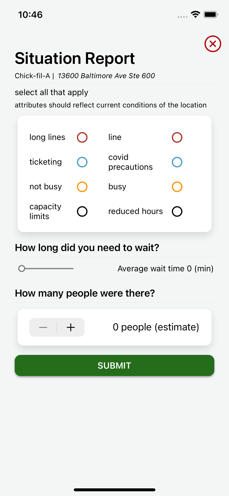

# Sesto-App using Xamarin.Forms 5
an iOS and Android app to report how crowded a place is. (pretty much the populartimes feature on google).

This uses firebase for email and password authentication, implemented on ios and android.

Screenshots:

